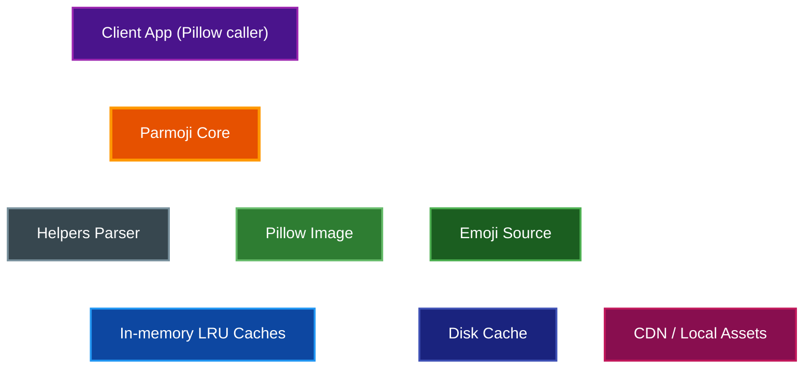
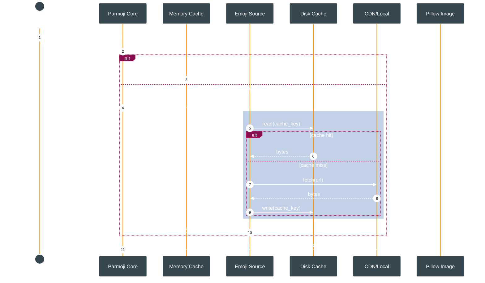

# Parmoji Architecture

High-level design of the Parmoji library for rendering Unicode and Discord emojis into Pillow images. Covers components, data flow, caching, and extensibility.

## Table of Contents
- [Overview](#overview)
- [Prerequisites](#prerequisites)
- [Component Model](#component-model)
- [Rendering Flow](#rendering-flow)
- [Sequence Diagram](#sequence-diagram)
- [Caching & Persistence](#caching--persistence)
- [Extensibility](#extensibility)
- [Examples](#examples)
- [Troubleshooting](#troubleshooting)
- [Related Documentation](#related-documentation)

## Overview
Parmoji augments Pillow text rendering by parsing input text into text/emoji nodes, fetching raster emoji images from configured sources, and compositing them alongside text. It supports Unicode emojis and Discord custom emojis.

## Prerequisites
- Python 3.11+ (tested on 3.11–3.13)
- Pillow installed and a valid TrueType font available at runtime

## Component Model
- Core (`src/parmoji/core.py`): Public `Parmoji` context manager; orchestrates parsing, caching, fetching, and drawing.
- Helpers (`src/parmoji/helpers.py`): Tokenizes strings into nodes and provides size helpers.
- Sources (`src/parmoji/source.py`, `src/parmoji/local_source.py`): Pluggable emoji providers (HTTP/CDN or local filesystem) with optional disk caching.
- Package Init (`src/parmoji/__init__.py`): Exposes API surface and version.

## Rendering Flow


Flow details
- The core parses text into nodes; for emoji nodes it queries memory cache, then the source.
- Sources read from disk cache first (when enabled), else fetch from CDN or local assets, then persist to disk and return bytes.
- The core scales/positions emojis relative to font metrics and composites them onto the Pillow image.

## Sequence Diagram


## Caching & Persistence
- Memory: Separate LRU caches for Unicode and Discord emojis sized by `cache_size` (split across caches).
- Disk: Per-source cache under `$XDG_CACHE_HOME/par-term/parmoji/<SourceClass>/` or `~/.cache/par-term/parmoji/<SourceClass>/`.
- Failure registry: `failed_requests.json` prevents repeated network retries of known-missing assets; successes clear entries.

## Extensibility
- New sources: Subclass the base HTTP/local source and implement URL/path resolution; opt into `disk_cache=True` if desired.
- Rendering controls: Adjust `emoji_scale_factor` and `emoji_position_offset` to tune visuals per font/style.

## Examples
```python
from parmoji import Parmoji
from PIL import Image, ImageFont

text = "Hello 👋 with Discord <:rooThink:596576798351949847>"
with Image.new("RGB", (550, 80), (255, 255, 255)) as image:
    font = ImageFont.truetype("arial.ttf", 24)
    with Parmoji(image) as p:
        p.text((10, 10), text, (0, 0, 0), font, emoji_scale_factor=1.0)
    image.show()
```

## Troubleshooting
- Emojis not rendering: Ensure the font supports surrogate pairs; try a known font and set `emoji_scale_factor` to 1.0.
- Unexpected network calls in tests: Disable disk cache for sources or mock network layers; clear failure cache via `source.clear_failed_cache()`.
- Blurry emojis: Use higher base font sizes or increase `emoji_scale_factor`; avoid resizing the final image post-render.
- Cache location issues: Set `XDG_CACHE_HOME` to control on-disk paths; delete the per-source directory to reset.
- Discord emoji not shown: Verify the numeric ID in `<:name:id>` and that `render_discord_emoji=True`.

## Related Documentation
- [Project README](../README.md) – Usage, features, and installation
- [Contributor Guide](../AGENTS.md) – Repository conventions and workflows
- [Documentation Style Guide](./DOCUMENTATION_STYLE_GUIDE.md) – Standards for docs and diagrams
